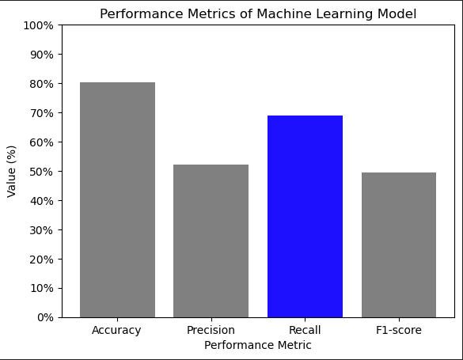
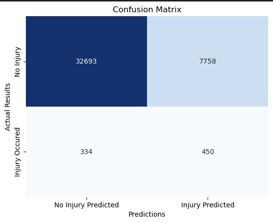

# Seattle Collision Data

##
## Data Overview
For our Project, we pulled the data from Data.gov for Vehicle Collisions from 2003 to present for the City of Seattle. 

## Summary 

### Percentage of Collisions under the influence of drugs or alcohol

[tableau link](https://public.tableau.com/app/profile/ivan.david.quesada/viz/seattleaccidentsplt/DUIdash?publish=yes)

The first graph is a grantt bar where we were able to get the percentages of collisions based on whether the driver was under the influence of drugs or alcohol or DUI, the majority of accidents the driver was not under the influence, although we can see that between the different years the percentage of drivers who were under the influence is around 4 and 5% of the cases.

### Total of Colissions for speeding

[tableau link](https://public.tableau.com/app/profile/ivan.david.quesada/viz/seattleaccidentsplt/speeddash?publish=yes)

In the second dashboard we collect information on the number of accidents and speed, in most cases the accidents recorded have been without the driver being at high speeds, in general terms collisions have been decreasing and it is because In Seattle after a study observed that the majority of accidents are caused by high speeds, from that they reduced the speed limits in the neighborhoods, as well as in the downtown area, which is where the majority of collisions are recorded.

### Collisions: Min and Max by year, months and day

[tableau link](https://public.tableau.com/app/profile/ivan.david.quesada/viz/seattleaccidentsplt/minmaxdash?publish=yes)

Have you ever wondered what day of the week is where more traffic accidents are recorded? The day in which more accidents are registered are Fridays, and Saturdays are the days in which there are more accidents based on DUI, for which it can be concluded that the majority of accidents were registered on weekends as well as DUI.

### Sum of Collisions by weather and light condition

In our dashboard relate the collisions with the weather and light conditions; Most of the accidents occur during the day and with a clear weather condition, in second place they occur during the nights. When it is raining the data is more equalized, accidents occur in almost the same proportion during the day as at night.

[tableau link](https://public.tableau.com/app/profile/ivan.david.quesada/viz/seattleaccidentsplt/weatherandcollisiontypedash?publish=yes)

### Fatalities and Injuries depending the collision type

Finally, we compare the number of fatalities and serious injuries based on the type of collision, which shows us that pedestrians are most at risk of being seriously injured or even killed in an accident, and the least risky type of collision is when making a right turn.
## Tableau Information
https://public.tableau.com/app/profile/tayler.despain/viz/CityofSeattleReportedVehicleAccidents/Dashboard1
https://public.tableau.com/app/profile/ivan.david.quesada/viz/seattleaccidentsplt/DUIdash?publish=yes
https://public.tableau.com/app/profile/ivan.david.quesada/viz/seattleaccidentsplt/speeddash?publish=yes
https://public.tableau.com/app/profile/ivan.david.quesada/viz/seattleaccidentsplt/minmaxdash?publish=yes
https://public.tableau.com/app/profile/ivan.david.quesada/viz/seattleaccidentsplt/weatherandcollisiontypedash?publish=yes
##

### Predicting Falities and Serious Injury using Machine Learning

#### What is the purpose of being able to predict whether a collision will cause serious injuries or fatalities?
Being able to accurately predict collision fatalities can have several potential benefits:

* Prevention and mitigation of accidents: If a model can accurately predict whether a collision is likely to result in fatalities, it can help in taking preventive measures to avoid such accidents or mitigate their severity. For example, if a collision is predicted to be highly likely to result in fatalities, emergency response teams can be dispatched quickly to the accident site, potentially saving lives through prompt medical attention.
* Resource allocation and planning: Predicting collision fatalities can help with resource allocation and planning for emergency services and medical facilities. For instance, hospitals and trauma centers can prepare for a potential influx of critically injured patients, ensuring that adequate resources and personnel are available to handle the situation effectively.
* Traffic safety and infrastructure planning: Insights gained from predicting collision fatalities can inform traffic safety policies and infrastructure planning. For example, identifying high-risk locations or road conditions associated with a higher likelihood of fatalities can lead to targeted interventions, such as improving road signage, adding traffic control measures, or implementing road safety campaigns in those areas.

Overall, accurately predicting collision fatalities can have significant societal benefits by potentially saving lives, improving traffic safety policies and infrastructure, and informing emergency response and resource allocation strategies.

#### Ok, so what did you build and does it work?
After spending several hours cleaning and preprocessing a messy and unusable CSV file with over 50 columns and nearly 250,000 rows, I successfully extracted relevant features such as light conditions, weather conditions, road conditions, and collision severity. I then performed exploratory data analysis (EDA) to gain insights into the data and built and trained a machine learning model to predict collision fatalities based on these features. 

The machine learning model was trained using a supervised learning approach, where historical collision data was used to train the model to predict the likelihood of a collision resulting in fatalities and serious injuries. The model was evaluated using various performance metrics such as accuracy, precision, recall, and F1 score to assess its effectiveness in predicting collision fatalities.

#### What machine learning algorithm did you choose and why?
We chose to go with the Random Forest Classifier algorithm because not only did it show high performance, it also;
* Provides a feature importance measure, which allows for the identification of the most important features in the dataset. This can help in understanding the underlying patterns and relationships in the data, and make informed decisions based on feature importance rankings. 
* Can capture non-linear relationships and interactions between features in the data, making it suitable for complex datasets where simple linear models may not perform well.
* Can handle large datasets and high-dimensional feature spaces efficiently, making it suitable for datasets with a large number of samples or features.

Based on the evaluation results, the model showed promising performance with high accuracy and reasonable precision, recall, and F1 score. When evalutating other models we looked for the high recall scores, meaning we wanted something that caught as many true negatives as possible.

## Presntation Slides
https://docs.google.com/presentation/d/1NGh0JGHu3NgqyXn_sbl0Y530mmzCxedCYg6hrpIQaPc/edit#slide=id.g219bedc804f_0_20
